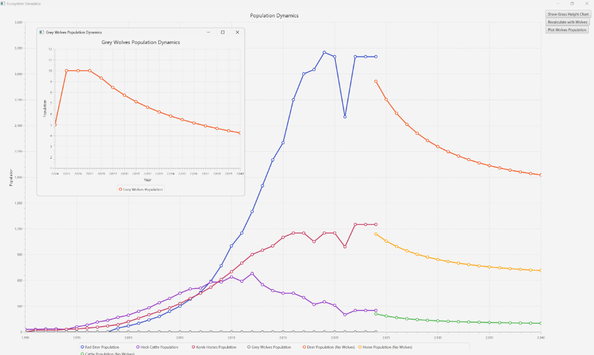

# Oostvaardersplassen Ecosystem Simulator

## Mathematical Modeling and Apex Predator Reintroduction Analysis

### Executive Summary

The **Oostvaardersplassen Ecosystem Simulator** is a Java-based computational modeling and visualization tool developed to analyze the ecological dynamics of large herbivores and test the viability of reintroducing apex predators into the Oostvaardersplassen Nature Reserve in Flevoland, Netherlands.

By combining thirty years of empirical field data (1990–2024) with Lotka-Volterra multi-species competition frameworks, forage-dependent carrying capacity models, and predator-prey differential dynamics, this project evaluates how top-down regulation via Grey Wolves (*Canis lupus*) can resolve severe herbivore overpopulation, arrest habitat degradation, and restore ecosystem equilibrium.

### Application Preview

<p align="center">
  
</p>

---

### Ecological Context and Problem Statement

The Oostvaardersplassen reserve encompasses approximately 5,600 hectares (3,600 hectares of marshland and 2,000 hectares of dry pasture). Created as a rewilding initiative, the reserve was stocked with large ungulates—Heck Cattle in 1990, Konik Horses in 1991, and Red Deer in 1999—to simulate prehistoric grazing regimes with minimal human intervention.

However, because the perimeter is enclosed by fencing and human infrastructure, natural animal migration is impossible. Crucially, the initial ecosystem design omitted top predators. In the absence of predation:

1. **Ungulate Population Explosion**: Populations grew exponentially. Red Deer surged to a peak of 3,250 individuals in 2019, Konik Horses reached 1,250, and Heck Cattle peaked at 680 in 2012. Total herbivore numbers reached over 4,750 animals on 2,000 hectares of grazing land—exceeding the sustainable carrying capacity by 1.6 to 2.0 times.
2. **Vegetation Depletion**: Overgrazing severely degraded plant biomass. Systematic measurements taken every August 1st show a continuous decline in average grass height from 28.79 cm in 1998 down to 15.01 cm in 2022.
3. **Starvation Crashing**: Deprived of winter forage, populations experienced catastrophic die-offs. In severe winters, annual mortality exceeded 2,650 animals (2019) and 2,860 animals (2020), triggering national public controversy regarding animal welfare and reserve management.

---

### Research Objectives and Sub-Questions

#### Main Research Question
What will be the impact on the populations of Red Deer, Konik Horses, and Heck Cattle if Grey Wolves are introduced into the Oostvaardersplassen Nature Reserve?

#### Analytical Sub-Questions

1. **Current Population Dynamics**: What are the baseline population growth trajectories and carrying capacity breaches of ungulates in the reserve, and how do they impact vegetation?
2. **Behavioral Shifts and Trophic Cascades**: What behavioral alterations (e.g., risk-sensitive foraging, "ecology of fear") and population changes occur in herbivore species following predator introduction?
3. **Implementation Risks**: What ecological and socio-economic risks exist, including potential wolf dispersal beyond reserve boundaries and livestock predation?
4. **Model Scope and Limitations**: What are the mathematical assumptions, simplifications, and limitations of the computational models and linear regression frameworks used?
5. **Ethical Considerations**: What ethical frameworks should guide decisions regarding predator introduction, animal welfare, and public stakeholder management?

---

### Mathematical Modeling Framework

The simulation engine integrates five core mathematical models implemented in Java:

#### 1. Exponential and Logistic Base Growth
In early years under unconstrained resources, population growth follows exponential dynamics:

$$N(t) = N_0 \, e^{r t}$$

where $N_0$ is initial population size, $r = b - d$ is intrinsic growth rate (birth rate minus death rate), and $t$ is time in years. As resource competition intensifies, growth transitions to logistic regulation constrained by carrying capacity $K$.

#### 2. Dynamic Forage-Dependent Carrying Capacity Model
Implemented in `CarryingCapacityModel.java`, carrying capacity $K$ is continuously recalculated based on available biomass, daily nutritional requirements, and vegetation height relative to historical baseline:

$$K = \left( \frac{\text{TOTAL\_FORAGE} \times \text{Allocation} \times \left(\frac{h_{\text{grass}}}{h_{\text{base}}}\right)}{\text{DailyNeed} \times 365} \right) \times \text{CompetitionFactor}$$

- **Total Base Forage**: 15,000,000 kg/year across dry land pastures.
- **Baseline Grass Height ($h_{\text{base}}$)**: 28.79 cm (1998 benchmark).
- **Daily Nutritional Intake**: Red Deer (10 kg/day), Konik Horses (20 kg/day), Heck Cattle (30 kg/day).

#### 3. Multi-Species Lotka-Volterra Competition Model
Implemented in `PopulationModel.java`, interspecific competition for limited pasture is modeled as:

$$\frac{d N_{\text{Deer}}}{dt} = r_D N_D \left(1 - \frac{N_D + \alpha_{DH} N_H + \alpha_{DC} N_C}{K_D}\right)$$

$$\frac{d N_{\text{Horse}}}{dt} = r_H N_H \left(1 - \frac{N_H + \alpha_{HD} N_D + \alpha_{HC} N_C}{K_H}\right)$$

$$\frac{d N_{\text{Cattle}}}{dt} = r_C N_C \left(1 - \frac{N_C + \alpha_{CD} N_D + \alpha_{CH} N_H}{K_C}\right)$$

- **Intrinsic Growth Rates ($r$)**: $r_{\text{Deer}} = 0.1737$, $r_{\text{Horse}} = 0.15$, $r_{\text{Cattle}} = 0.10$.
- **Carrying Capacities ($K$)**: $K_{\text{Deer}} = 1,698$, $K_{\text{Horse}} = 679$, $K_{\text{Cattle}} = 113$.
- **Competition Coefficients ($\alpha_{ij}$)**: $0.01$ to $0.85$ based on diet overlap.

#### 4. Remodeled Lotka-Volterra Predator-Prey Interaction Model
Implemented in `PredatorPreyInteraction.java`, predator consumption and preference weightings reflect relative body mass and dietary selectivity:

$$\frac{d N_{\text{Deer}}}{dt} = r_D N_D \left(1 - \frac{N_D + \alpha_{DH} N_H + \alpha_{DC} N_C}{K_D}\right) - a \cdot N_D \cdot N_W$$

$$\frac{d N_W}{dt} = a \cdot b \left(N_D + \beta_H N_H + \beta_C N_C\right) N_W - d \cdot N_W$$

- **Predation Rate ($a$)**: $0.01$.
- **Wolf Mortality Rate ($d$)**: $0.5$.
- **Prey Weightings**: Red Deer (80–150 kg, primary prey target), Konik Horses (250–400 kg), Heck Cattle (400–600 kg).
- **Wolf Dietary Threshold**: 1 wolf consumes the equivalent of 250 deer per year in the high-density simulation safety margin, with dynamic wolf carrying capacity capped at:

$$K_{\text{Wolf}} = \frac{N_{\text{Deer}}}{250} + \frac{N_{\text{Horse}}}{1000} + \frac{N_{\text{Cattle}}}{800}$$

#### 5. Temperature and Grass Height Linear Regression Model
Grass height variations ($y$) against average temperature ($x$) are calculated using linear regression and covariance analysis:

$$y = m x + c$$

$$r = \frac{\text{Cov}(X, Y)}{\sigma_X \cdot \sigma_Y}$$

The resulting negative correlation demonstrates that elevated temperatures combined with unmanaged herbivory significantly accelerate vegetation depletion.

---

### Empirical Simulation Results and Comparative Analysis

#### Scenario 1: Status Quo (Unmanaged Growth Without Predators)
In the absence of wolves, ungulate populations stabilize at unsustainable equilibrium levels far above target ecological thresholds:
- **Red Deer**: Stabilizes at approximately **1,800 individuals** (compared to the conservation target of **500**).
- **Konik Horses**: Stabilizes at approximately **700 individuals**.
- **Heck Cattle**: Suppressed to **120 individuals** due to inferior competitive ability against deer and horses.
- **Outcome**: Chronic overgrazing persists, grass height remains suppressed below 16 cm, and winter starvation cycles continue.

#### Scenario 2: Trophic Cascade (With Grey Wolf Reintroduction)
Upon introducing an initial pack of Grey Wolves (starting pack size $N_W = 5$ to $13$):
- **Red Deer**: Undergoes a substantial reduction during years 2–5, stabilizing near **830 individuals**—significantly closer to the 500-animal target.
- **Konik Horses**: Stabilizes at a healthy population of **300 individuals**.
- **Heck Cattle**: Stabilizes at **55 individuals**.
- **Grey Wolves**: Population self-regulates and balances between **1 and 10 individuals**, constrained by prey density.
- **Outcome**: Herbivore pressure on vegetation is alleviated, allowing grass recovery and mitigating winter starvation spikes.

---

### Risk Assessment and Ethical Considerations

1. **Human-Wildlife Conflict**: The Oostvaardersplassen reserve is surrounded by urban infrastructure and agricultural land in Flevoland. Dispersal outside the reserve poses risks to domestic livestock (e.g., 237 wolf predation incidents reported across the Netherlands in 2024). Recommended mitigations include perimeter wolf-proof fencing and livestock compensation schemes.
2. **Fear Ecology and Spatial Distribution**: Predator presence alters herbivore foraging behavior, forcing ungulates away from exposed open pastures into sheltered micro-habitats, preventing localized overgrazing.
3. **Animal Welfare vs. Ecosystem Health**: Reintroducing predators reduces slow starvation deaths among herbivores by replacing starvation mortality with natural predation, aligning with wildlife management ethical principles (Minteer & Puschmann, 2020).

---

### System Architecture and Technology Stack

#### Software Stack
- **Language**: Java 17
- **UI Framework**: JavaFX 17 (Controls, FXML, Graphics)
- **Chart Visualizations**: JavaFX Charts & JFreeChart 1.5.2
- **Data Parsing**: Jackson Databind 2.15.2
- **Spreadsheet Processing**: Apache POI 5.2.3
- **Build System**: Maven 3.x

#### Package Structure

```
com.ecosystem (OostvaarderplassenApp)
├── system
│   └── Main.java                      # Main JavaFX application entry point
├── environment
│   ├── AnimalsData.java               # DTO for animal population JSON serialization
│   ├── EnvironmentalFactors.java      # Dataset loader and chart series manager
│   ├── GrassGrowthModel.java          # Parser for grass height data
│   └── GrassHeightData.java           # Data container for annual grass height metrics
├── models
│   ├── CarryingCapacityModel.java     # Forage and grass height dependent carrying capacity
│   └── PopulationModel.java           # Multi-species Lotka-Volterra competition model
├── interactions
│   └── PredatorPreyInteraction.java   # Lotka-Volterra predator-prey differential solver
├── gui
│   ├── Graphs.java                    # Multi-series population dynamics chart dashboard
│   ├── ControlPanel.java              # Interactive UI button panel (scenario toggles)
│   ├── GrassChart.java                # Separate visualization stage for grass height history
│   ├── SimulationArea.java            # Graphical canvas grid renderer
│   └── SimulationMenuBar.java         # Save/Load menu interface
└── docs
    └── OstVP_Project_Report.pdf       # Full academic project report PDF
```

---

### Installation and Execution Guide

#### Prerequisites
- Java Development Kit (JDK) 17 or higher
- Apache Maven 3.6 or higher

#### Building the Project
Clone the repository and compile the source files using Maven:

```bash
git clone https://github.com/TarasZinchenko/oostvaardersplassen.git
cd oostvaardersplassen
mvn clean compile
```

#### Running the Application
Launch the JavaFX simulation GUI using Maven:

```bash
mvn exec:java -Dexec.mainClass="system.Main"
```

#### Interactive GUI Features
- **Main Population Dynamics Chart**: Displays historical data (1990–2024) and projected population curves (2024–2040).
- **Recalculate with / without Wolves**: Interactive toggle button in the control panel to compare status quo vs. predator reintroduction scenarios in real time.
- **Plot Wolves Population**: Spawns a dedicated window displaying projected Grey Wolf pack trajectories.
- **Show Grass Height Chart**: Opens a secondary chart window illustrating the 1998–2022 trend in vegetation height.

---

### Academic Attribution and References

#### Authors (Group 5)
- **Taras Zinchenko** (Student ID: 720922)
- **Nicoleta Mutruc** (Student ID: 716144)
- **Md Lokman Hosan** (Student ID: 697578)
- **Bram Schrijen** (Student ID: 723589)
- **Suraj Giri** (Student ID: 704932)
- **Giulia Benetti** (Student ID: 706867)

#### Documentation
The full 17-page academic research paper detailing the methodology, literature review, and complete analysis is available at [`docs/OstVP_Project_Report.pdf`](docs/OstVP_Project_Report.pdf).

#### Key References
1. Gotelli, N. J. (2008). *A Primer of Ecology*. Sinauer Associates.
2. Lotka, A. J. (1925). *Elements of Physical Biology*. Williams & Wilkins.
3. ICMO2. (2010). *Re-profiling the Oostvaardersplassen*: Report of the second International Commission on Management of the Oostvaardersplassen.
4. Minteer, B. A., & Puschmann, K. P. (2020). *The Ethics of Wildlife Management and Conservation: What Should We Try to Protect?* Oxford University Press.
5. Montgomery, D. C., Peck, E. A., & Vining, G. G. (2012). *Introduction to Linear Regression Analysis*. John Wiley & Sons.
